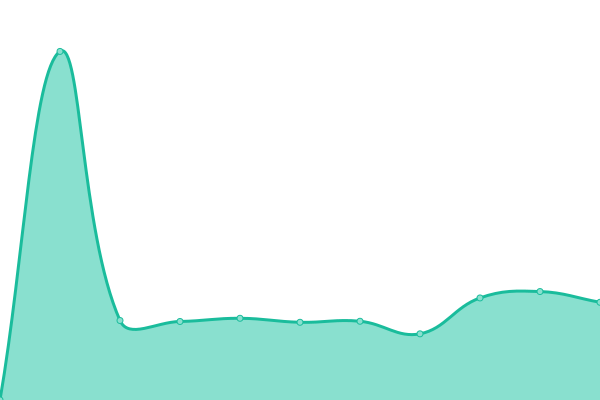

# [📈 Live Status](https://dapodix.github.io/status): <!--live status--> **🟧 Partial outage**

This repository contains the open-source uptime monitor and status page for [Dapodix](https://dapodix.github.io/status), powered by [Upptime](https://github.com/upptime/upptime).

With [Upptime](https://upptime.js.org), you can get your own unlimited and free uptime monitor and status page, powered entirely by a GitHub repository. We use [Issues](https://github.com/dapodix/status/issues) as incident reports, [Actions](https://github.com/dapodix/status/actions) as uptime monitors, and [Pages](https://dapodix.github.io/status) for the status page.

<!--start: status pages-->
<!-- This summary is generated by Upptime (https://github.com/upptime/upptime) -->
<!-- Do not edit this manually, your changes will be overwritten -->
<!-- prettier-ignore -->
| URL | Status | History | Response Time | Uptime |
| --- | ------ | ------- | ------------- | ------ |
| [Dapo Kemdikbud](https://dapo.kemdikbud.go.id/) | Aktif | [dapo-kemdikbud.yml](https://github.com/dapodix/status/commits/master/history/dapo-kemdikbud.yml) | 

 2950ms
     
 | 

   

| [Manajemen Dapodik](http://datadik.kemdikbud.go.id/) | Non-aktif | [manajemen-dapodik.yml](https://github.com/dapodix/status/commits/master/history/manajemen-dapodik.yml) | 

 0ms
     
 | 

   

| [SP Datadik](https://sp.datadik.kemdikbud.go.id/) | Aktif | [sp-datadik.yml](https://github.com/dapodix/status/commits/master/history/sp-datadik.yml) | 

 4681ms
     
 | 

   

| [PTK Datadik](https://ptk.datadik.kemdikbud.go.id) | Aktif | [ptk-datadik.yml](https://github.com/dapodix/status/commits/master/history/ptk-datadik.yml) | 

 8531ms
     
 | 

   

| [Info GTK](https://info.gtk.kemdikbud.go.id/) | Non-aktif | [info-gtk.yml](https://github.com/dapodix/status/commits/master/history/info-gtk.yml) | 

 0ms
     
 | 

   

| [Portal BOS](https://bos.kemdikbud.go.id/) | Aktif | [portal-bos.yml](https://github.com/dapodix/status/commits/master/history/portal-bos.yml) | 

 3282ms
     
 | 

   

| [PMP Dikdasmen](http://pmp.kemdikbud.go.id/) | Aktif | [pmp-dikdasmen.yml](https://github.com/dapodix/status/commits/master/history/pmp-dikdasmen.yml) | 

 2888ms
     
 | 

   

| [Pemetaan Mutu PAUD](https://pemetaanmutu.paud-dikmas.kemdikbud.go.id/) | Aktif | [pemetaan-mutu-paud.yml](https://github.com/dapodix/status/commits/master/history/pemetaan-mutu-paud.yml) | 

 1936ms
     
 | 

   

| [Verval SP](http://vervalsp.data.kemdikbud.go.id/) | Aktif | [verval-sp.yml](https://github.com/dapodix/status/commits/master/history/verval-sp.yml) | 

 1940ms
     
 | 

   

| [Verval PTK](http://vervalptk.data.kemdikbud.go.id/) | Aktif | [verval-ptk.yml](https://github.com/dapodix/status/commits/master/history/verval-ptk.yml) | 

 3943ms
     
 | 

   

| [Verval PD](http://vervalpd.data.kemdikbud.go.id/) | Aktif | [verval-pd.yml](https://github.com/dapodix/status/commits/master/history/verval-pd.yml) | 

 2334ms
     
 | 

   

| [Verval Ponsel](https://vervalponsel.data.kemdikbud.go.id/) | Aktif | [verval-ponsel.yml](https://github.com/dapodix/status/commits/master/history/verval-ponsel.yml) | 

 1912ms
     
 | 

   

| [Verval Ijazah](https://info.gtk.kemdikbud.go.id/verval_s1/index.php) | Non-aktif | [verval-ijazah.yml](https://github.com/dapodix/status/commits/master/history/verval-ijazah.yml) | 

 0ms
     
 | 

   

| [Simdak PAUD](https://app.paud-dikmas.kemdikbud.go.id/simdak/) | Aktif | [simdak-paud.yml](https://github.com/dapodix/status/commits/master/history/simdak-paud.yml) | 

 2014ms
     
 | 

   

| [BANSM](https://bansm.kemdikbud.go.id/) | Non-aktif | [bansm.yml](https://github.com/dapodix/status/commits/master/history/bansm.yml) | 

 0ms
     
 | 

   

| [BAN PAUD & PNF](https://banpaudpnf.kemdikbud.go.id/) | Aktif | [ban-paud-and-pnf.yml](https://github.com/dapodix/status/commits/master/history/ban-paud-and-pnf.yml) | 

 1895ms
     
 | 

   

| [BANPAUD&PNF Sispena](https://banpaudpnf.kemdikbud.go.id/sispena/) | Aktif | [banpaud-and-pnf-sispena.yml](https://github.com/dapodix/status/commits/master/history/banpaud-and-pnf-sispena.yml) | 

 1293ms
     
 | 

   

| [CDN Dapodik](https://cdn-dapodik.kemdikbud.go.id/) | Aktif | [cdn-dapodik.yml](https://github.com/dapodix/status/commits/master/history/cdn-dapodik.yml) | 

 1887ms
     
 | 

   

<!--end: status pages-->

[**Visit our status website →**](https://dapodix.github.io/status)

## 📄 License

- Code: [MIT](./LICENSE) © [Dapodix](https://dapodix.github.io/status)
- Data in the `./history` directory: [Open Database License](https://opendatacommons.org/licenses/odbl/1-0/)
