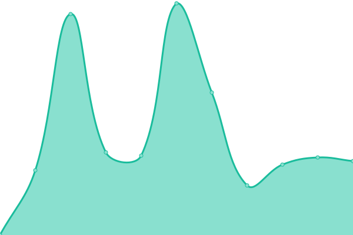
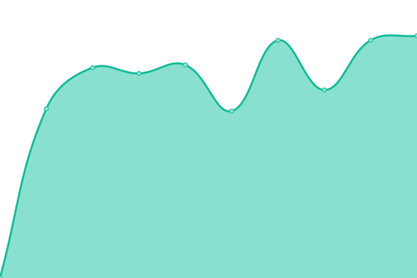
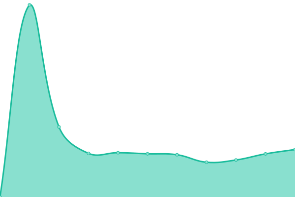

# [📈 Live Status](https://dapodix.github.io/status): <!--live status--> **🟨 Partial outage**

This repository contains the open-source uptime monitor and status page for [Dapodix](https://dapodix.github.io/status), powered by [Upptime](https://github.com/upptime/upptime).

With [Upptime](https://upptime.js.org), you can get your own unlimited and free uptime monitor and status page, powered entirely by a GitHub repository. We use [Issues](https://github.com/dapodix/status/issues) as incident reports, [Actions](https://github.com/dapodix/status/actions) as uptime monitors, and [Pages](https://dapodix.github.io/status) for the status page.

<!--start: status pages-->
<!-- This summary is generated by Upptime (https://github.com/upptime/upptime) -->
<!-- Do not edit this manually, your changes will be overwritten -->

| URL                                                                     | Status  | History                                                                                                   | Response Time                                                                            | Uptime                                                                                                                                                                                                                             |
| ----------------------------------------------------------------------- | ------- | --------------------------------------------------------------------------------------------------------- | ---------------------------------------------------------------------------------------- | ---------------------------------------------------------------------------------------------------------------------------------------------------------------------------------------------------------------------------------- |
| [Dapo Kemdikbud](https://dapo.kemdikbud.go.id/)                         | 🟩 Up   | [dapo-kemdikbud.yml](https://github.com/dapodix/status/commits/master/history/dapo-kemdikbud.yml)         |  2622ms     |          |
| [Manajemen Dapodik](https://datadik.kemdikbud.go.id/)                   | 🟥 Down | [manajemen-dapodik.yml](https://github.com/dapodix/status/commits/master/history/manajemen-dapodik.yml)   |  0ms     |      |
| [SP Datadik](https://sp.datadik.kemdikbud.go.id/)                       | 🟥 Down | [sp-datadik.yml](https://github.com/dapodix/status/commits/master/history/sp-datadik.yml)                 |  0ms            |                    |
| [PTK Datadik](https://ptk.datadik.kemdikbud.go.id)                      | 🟩 Up   | [ptk-datadik.yml](https://github.com/dapodix/status/commits/master/history/ptk-datadik.yml)               |  4485ms        |                |
| [SSO Datadik](https://sso.datadik.kemdikbud.go.id/)                     | 🟥 Down | [sso-datadik.yml](https://github.com/dapodix/status/commits/master/history/sso-datadik.yml)               |  0ms           |                  |
| [Portal BOS](https://bos.kemdikbud.go.id/)                              | 🟩 Up   | [portal-bos.yml](https://github.com/dapodix/status/commits/master/history/portal-bos.yml)                 |  1278ms         |                  |
| [PMP Dikdasmen](http://pmp.kemdikbud.go.id/)                            | 🟩 Up   | [pmp-dikdasmen.yml](https://github.com/dapodix/status/commits/master/history/pmp-dikdasmen.yml)           |  1728ms      |            |
| [Pusdatin](https://pusdatin.kemdikbud.go.id/)                           | 🟥 Down | [pusdatin.yml](https://github.com/dapodix/status/commits/master/history/pusdatin.yml)                     |  13985ms          |                        |
| [Pemetaan Mutu PAUD](https://pemetaanmutu.paud-dikmas.kemdikbud.go.id/) | 🟩 Up   | [pemetaan-mutu-paud.yml](https://github.com/dapodix/status/commits/master/history/pemetaan-mutu-paud.yml) |  2339ms |  |
| [Verval SP](http://vervalsp.data.kemdikbud.go.id/)                      | 🟩 Up   | [verval-sp.yml](https://github.com/dapodix/status/commits/master/history/verval-sp.yml)                   |  2060ms          |                    |
| [CDN Dapodik](https://cdn-dapodik.kemdikbud.go.id/)                     | 🟩 Up   | [cdn-dapodik.yml](https://github.com/dapodix/status/commits/master/history/cdn-dapodik.yml)               |  3422ms        |                |

<!--end: status pages-->

[**Visit our status website →**](https://dapodix.github.io/status)

## 📄 License

- Code: [MIT](./LICENSE) © [Dapodix](https://dapodix.github.io/status)
- Data in the `./history` directory: [Open Database License](https://opendatacommons.org/licenses/odbl/1-0/)
